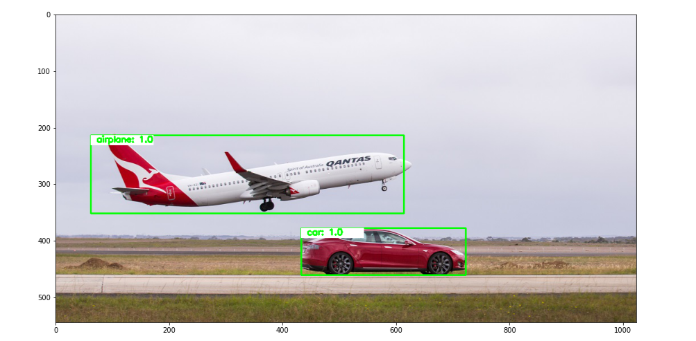

**<h1 align=center>Object Detection with Faster R-CNN</h1>**

 

<small>Picture Source: <a  href="https://www.forecr.io/blogs/ai-algorithms/how-to-run-tensorflow-object-detection-in-real-time-with-raspberry-v2-csi-camera-on-nvidia%C2%AE-jetson%E2%84%A2-nano%E2%84%A2">forecr</a></small>

 

<h2>Description</h2>

<h3>Context</h3>

Faster R-CNN is a method for object detection that uses region proposal. In this lab, you will use Faster R-CNN pre-trained on the coco dataset. You will learn how to detect several objects by name and to use the likelihood of the object prediction being correct.

 

<h3>Object Detection Models</h3>

Types of Object Detection Sliding window techniques are slow. Fortunately, there are two major types of object detection that speed up the process. <i>Region-based object detection</i> breaks up the image into regions and performs a prediction, while <i>Single-Stage object detection </i>uses the entire image.

<ul>
<li><b><i>Region-Based Convolutional Neural Network (R-CNN)</i></b> are usually more accurate but slower; they include <i>R-CNN</i>, <i>Fast R-CNN</i> and <i>Faster R-CNN</i>.</li>
<li><b><i>Single-Stage</i></b> methods are faster but less accurate and include techniques like <i>Single Shot Detection (SSD)</i> and <i>You Only Look Once (YOLO)</i>.</li>
</ul>

 

In the following lab, you will use <i>Faster R-CNN</i> for prediction. You will train an <i>SSD</i> model, even though <i>SSD</i> is considerably faster than other methods, it will still take a long time to train. Therefore we will train most of the model for you, and you will train the model for the last few iterations.

 

<h3>Faster R-CNN</h3>

<i>Faster R-CNN</i> uses the more convenient <i>Region Proposal Network</i> instead of costly selective search.

<i>Faster R-CNN</i> can be analyzed in two stages:

<ul>
<li><b><i>Region Proposal Network (RPN):</i></b> The first stage, <i>RPN</i>, is a deep convolutional neural network for suggesting regions. <i>RPN</i> takes any size of input as input and generates a rectangular proposal that may belong to a set of objects based on the object score. It makes this suggestion by shifting a small mesh over the feature map generated by the convolutional layer.</li>
<li><b><i>Fast R-CNN:</i></b> These calculations produced by <i>RPN</i> are inserted into the Fast R-CNN architecture and the class of the object is estimated with a classifier and the bounding box is estimated with a regressor.</li>
</ul>

 

<h3>Keywords</h3>

<ul>
<li>Faster R-CNN</li>
<li>Object Detection</li>
<li>ResNet-50-FPN</li>
<li>COCO</li>
</ul>

 

<h2>Statement</h2>

Apply object detection with <i>Faster R-CNN</i> to classify predetermined objects using objects name and/or to use the likelihood of the object.

 

<h2>About Faster R-CNN and ResNet-50-FPN</h2>

<small>Picture Source: <a  href="https://www.researchgate.net/profile/Andra-Petrovai/publication/329616112/figure/fig1/AS:739657281191939@1553359446745/A-shared-ResNet-FPN-network-is-used-for-3-tasks-The-Faster-RCNN-head-performs-object.ppm">Andra Petrovai</a>

<a  href='https://arxiv.org/abs/1506.01497?utm_medium=Exinfluencer&utm_source=Exinfluencer&utm_content=000026UJ&utm_term=10006555&utm_id=NA-SkillsNetwork-Channel-SkillsNetworkCoursesIBMDeveloperSkillsNetworkCV0101ENCoursera25797139-2021-01-01'>Faster R-CNN</a> is a model that predicts both bounding boxes and class scores for potential objects in the image pre-trained on <a  href="https://cocodataset.org/?utm_medium=Exinfluencer&utm_source=Exinfluencer&utm_content=000026UJ&utm_term=10006555&utm_id=NA-SkillsNetwork-Channel-SkillsNetworkCoursesIBMDeveloperSkillsNetworkCV0101ENCoursera25797139-2021-01-01">COCO</a>. Faster R-CNN model with a ResNet-50-FPN backbone from <a  href='https://arxiv.org/abs/1506.01497'>the Faster R-CNN: Towards Real-Time Object Detection with Region Proposal Networks paper.</a>

 

<h3>Training for Object Detection</h3>

Object detection is based on two principles. The first is the learnable parameters in the created rectangle (box), and the second is the size of the created box (coordinate information). While the model is being trained, ground truth and prediction values are evaluated with the difference of squares. Evaluations depend on the size of the ground truth rectangles created through functions. The functions calculate the difference between the ground truth box and the predicted rectangle.

<b>Loss equasion:</b>

$$||box\ - \hat{box}||^2 = (y_{min} - \hat{y}_{min})^2 + (y_{max} - \hat{y}_{max})^2 + (x_{min} - \hat{x}_{min})^2 + (x_{max} - \hat{x}_{max})^2$$

 

<h4>Image Without Object Detection (Original Image)</h4>

<h4>Image With Object Detection</h4>

Function output:

<small>Label: <b>car</b></small>

<small>Box coordinates: 433, 377, 723, 460</small>

<small>Probability: 0.9993621706962585</small>

  
 
<small>Label: <b>airplane</b></small>

<small>Box coordinates: 62, 213, 614, 351</small>

<small>Probability: 0.9987056255340576</small>

 

<h2>References</h2>

<ul>
<li><a href="https://www.ibm.com/">IBM</a></li>
<li><a href='https://github.com/jsantarc'>Joseph Santarcangelo</a></li>
<li><a href="https://pytorch.org/vision/main/models/generated/torchvision.models.detection.retinanet_resnet50_fpn.html">PyTorch</a></li>
<li><a href='https://arxiv.org/abs/1506.01497'>Computer Vision and Pattern Recognition - Cornell University<a/></li>
<li><a href='https://pillow.readthedocs.io/en/stable/index.html?utm_medium=Exinfluencer&utm_source=Exinfluencer&utm_content=000026UJ&utm_term=10006555&utm_id=NA-SkillsNetwork-Channel-SkillsNetworkCoursesIBMDeveloperSkillsNetworkCV0101ENCoursera25797139-2021-01-01'>Pillow Docs</a></li>
<li><a href='https://opencv.org/?utm_medium=Exinfluencer&utm_source=Exinfluencer&utm_content=000026UJ&utm_term=10006555&utm_id=NA-SkillsNetwork-Channel-SkillsNetworkCoursesIBMDeveloperSkillsNetworkCV0101ENCoursera25797139-2021-01-01'>OpenCV</a></li>
<li><a href="https://www.forecr.io/blogs/ai-algorithms/how-to-run-tensorflow-object-detection-in-real-time-with-raspberry-v2-csi-camera-on-nvidia%C2%AE-jetson%E2%84%A2-nano%E2%84%A2">forecr</a></li>
<li>Gonzalez, Rafael C., and Richard E. Woods. "Digital image processing." (2017).</li>
</ul>

 

<h2>Contact Me</h2>

If you have something to say to me please contact me: 

 - Twitter: [Doguilmak](https://twitter.com/Doguilmak)  
 - Mail address: doguilmak@gmail.com
